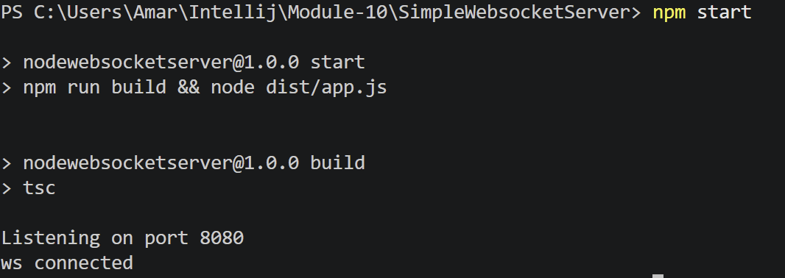
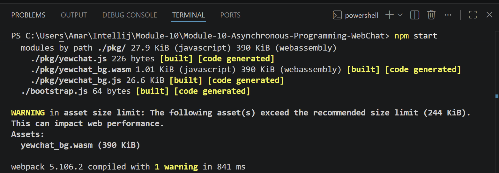
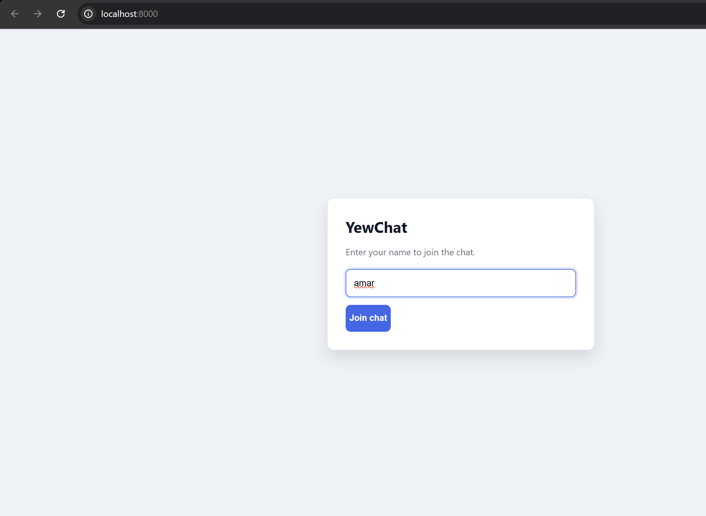
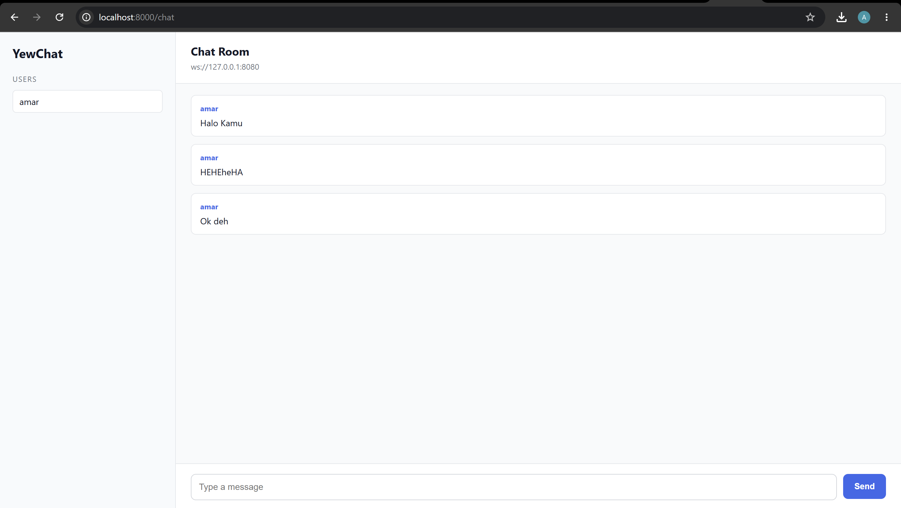
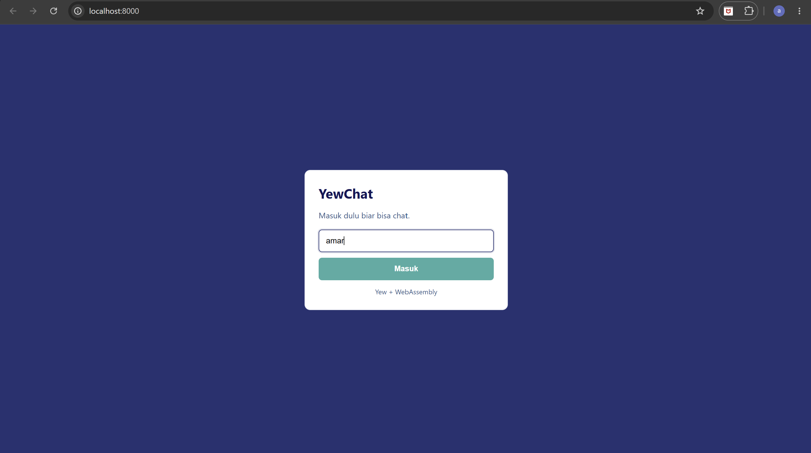
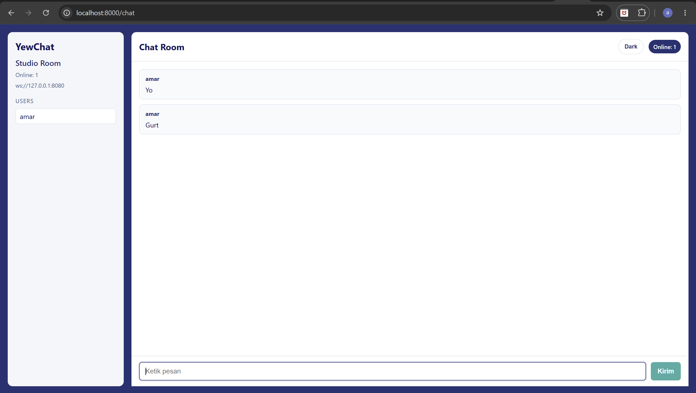
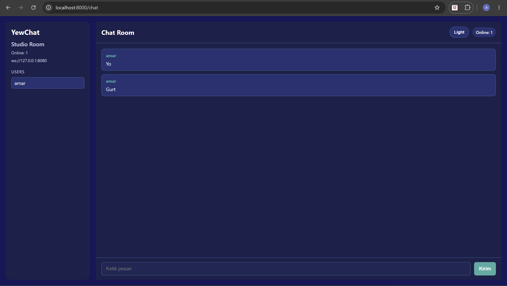
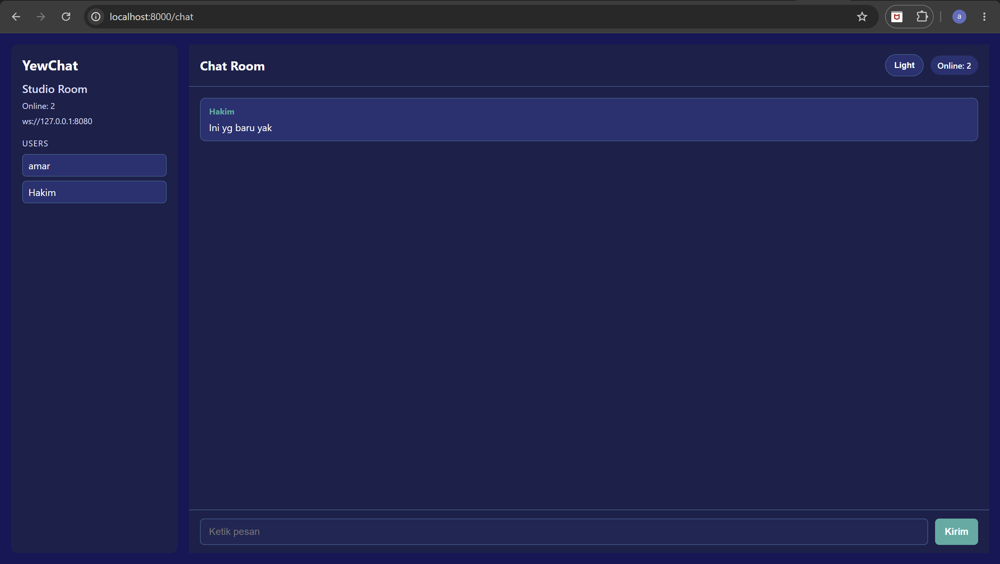

# Module 10 - Tutorial 3 (WebChat using Yew)

## Experiment 3.1: Original Code

### Cara Menjalankan

1. Jalankan websocket server (bisa pake repo https://github.com/jtordgeman/SimpleWebsocketServer, terus ikutin step nya di readme nya)

2. Jalankan Yew client (repo ini):
   ```bash
   npm start
   ```

3. Buka browser:
   ```text
   http://localhost:8000
   ```

### Screenshots






### Reflection / Notes

Di eksperimen 3.1 ini aku jalanin server websocket dan client YewChat secara bersamaan gitu. Server jalan di port 8080, sedangkan client di port 8000. Setelah server dan client berhasil dijalankan, webchat dapat diakses lewat browser di localhost:8000. User bisa masukin username lalu masuk ke halaman chat untuk ngirim pesan realtime lewat websocket connection. Dari experiment ini aku jadi lebih ngerti gimana asynchronous programming dan websocket dipakai di aplikasi web realtime. Selain itu aku juga jadi lebih ngerti gimana Rust bisa dipakai buat frontend web application pake Yew dan WebAssembly.

## Experiment 3.2: Be Creative

### Perubahan

- Theme warna nya aku ganti ke pake color scheme #232F72, #36ADA3, dll (dapet dari https://colorhunt.co/palette/121358232f722f578a36ada3)
- Halaman login nya dibuat jadi lebih simple, tombol masuk full lebar
- Halaman chat ada toggle light/dark mode
- Input chat bisa kirim pesan dengan tombol Enter

Tambahan Keterangan UI nya

- Online: nunjukin jumlah user yang lagi aktif di chat
- Studio Room: nama room yang aku pake buat tampilan
- ws://127.0.0.1:8080: alamat websocket server yang dipake client
- Chat Room: judul halaman chat nya

### Screenshots

#### Login Page

#### Chat Light Theme

#### Chat Dark Theme

#### Online Users


### Reflection / Notes

Di experiment 3.2 ini aku fokus bikin tampilan yang simpel tapi lebih enak dilihat. Aku ganti warna biar konsisten dan gampang dilihat. Di halaman chat aku tambahin toggle light/dark mode biar bisa ganti theme nya gitu. Tombol masuk di login nya juga aku bikin full lebar biar lebih rapi. Terus utk tampilan UI di chat room nya juga aku ubah2 dikit biar lebih simple dan infonya dapet semua gitu.
