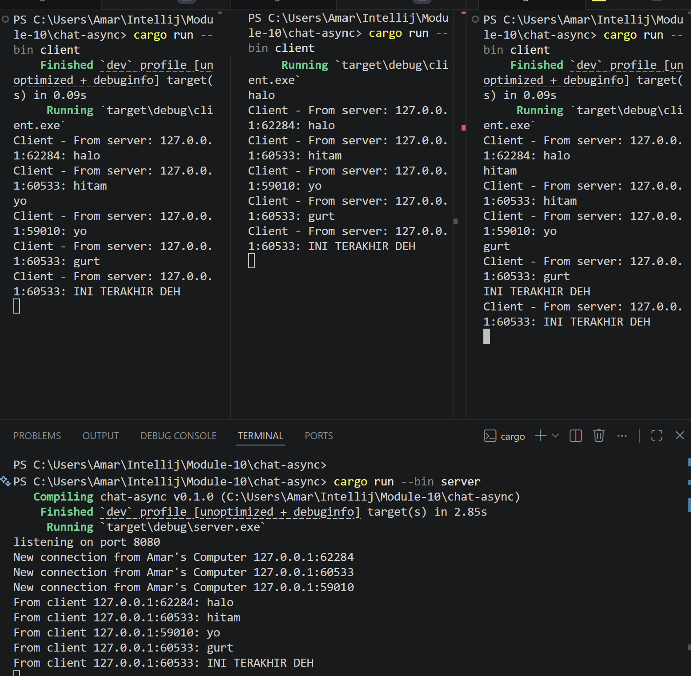

## Experiment 2.1 - Original Code and How It Runs

Pada experiment ini aku mencoba menjalankan aplikasi broadcast chat menggunakan websocket di Rust. Program terdiri dari 1 server dan 3 client yang saling terhubung secara realtime.

Saat salah satu client mengirim pesan, server akan menerima lalu melakukan broadcast ke semua client lainnya. Dari experiment ini aku jadi lebih ngerti bagaimana asynchronous programming dan websocket dipakai untuk komunikasi realtime antar banyak client sekaligus.

## Experiment 2.2 - Modifying Port

Pada experiment ini aku mengubah websocket port dari `2000` menjadi `8080`.

Perubahan dilakukan pada sisi server dan client karena websocket connection membutuhkan kedua sisi menggunakan port yang sama agar bisa saling terhubung. Setelah port diubah menjadi `8080`, server dan semua client tetap bisa berjalan dengan normal dan proses broadcast chat masih berjalan secara realtime.

## Experiment 2.3 - Small Changes, Add IP and Port

Pada experiment ini aku melakukan sedikit modifikasi pada aplikasi chat dengan menambahkan informasi IP dan port dari pengirim pesan.

Sekarang setiap pesan yang diterima client akan menampilkan alamat pengirim, misalnya seperti:

```text
Client - From server: 127.0.0.1:62284: halo
```

Dengan perubahan ini, client jadi bisa mengetahui pesan berasal dari koneksi yang mana. Dari experiment ini aku jadi lebih ngerti bagaimana message dikirim dari server ke semua client menggunakan mekanisme broadcast websocket.

